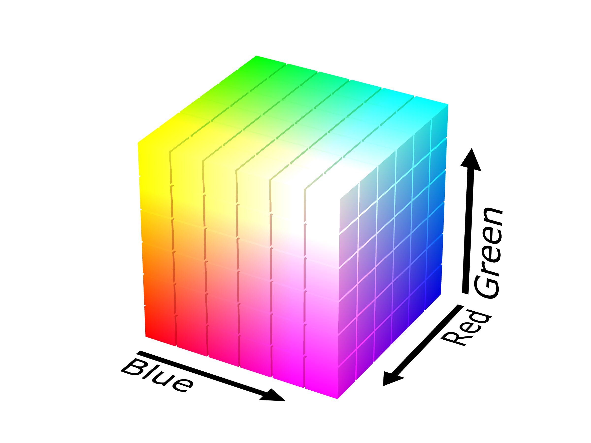

```{r setup, include=FALSE}
knitr::opts_chunk$set(echo = TRUE)
```

Welcome to the world of Pokémon!
================================

In this totally free guide\*, I'll show you how to get started with data analysis and train the perfect team of six Pokémon! (Whooooo!)

\* Please don't send me money, or I'll be sued. I'm open to receiving shiny black Charizards via trades though. 

You'll be able to use data to analyze just about anything, but since it's never been done before, we'll be looking at Pokémon! Specifically, I'll show you how to: 

1) get started with statistical software, 

2) work with the Pokémon sprite files, 

3) analyze one- and multi-dimensional data, 

4) fit a linear regression model, 

5) use advanced statistics to maximize the competitive edge of your team, and therefore,

6) become a Pokémon master!

For the more advanced readers, I'll also provide an analysis of the Pokémon matchup data and we'll train a couple of artificial neural networks to categorize Pokémon. 

The sprites were found online (www.dragonflycave.com). The rest of the data are from veekun's excellent pokedex repo on GitHub (www.github.com/veekun/pokedex). 


Preview
=======
I'll show you around some examples before we start writing any code. 

Let's look at some Pokémon!
---------------------------

I'll start by showing you one instance out of the many interactive elements present throughout this document. You should be able to input any Gen 1 to 5 Pokémon's name, and that Pokémon should appear below. By default, this plot should be showing you Pikachu!

```{r seepokemon, echo=FALSE, fig.height=10, message=FALSE}
source("pokehelp.R")
source("pokesprites.R")
inputPanel(
  selectInput("n_pokemon", label = "Pokemon name:", selected="pikachu", choices=pokenames, width = NULL)
)

renderPlot({
  plotSprite(nameToNumber(input$n_pokemon))
}, height=500, width=500)
```


Analyzing the sprite data
-------------------------

Hmm, Pikachu's yellowyness is one of its iconic features. But is it the *most* yellow Pokémon? To answer this, we first need to learn a little bit about how the sprites, or images, are represented by the computer. What do I mean by this? Well, to us, the most natural and useful representation of a PNG is when we see it on our screen! But we need a different way of thinking about an image file in order to work with it effectively on our computers. 

For our guide, each Pokémon sprite will be represented as a matrix with 4 layers (RGB + transparancy). Woah, what does that mean? It's actually very simple. You know how each sprite is just a grid of pixels on your display? Well, a matrix is just a grid of numbers, and here each number in the grid corresponds to the intensity (from 0 to 1) of the pixel of the image. We need four of these matrices to store all of the color information: the first matrix stores the amount of red at each pixel, the second stores green, and the third stores the amount of blue. The fourth layer is supposed to say how transparent the image is at each pixel, but for our sprites, each pixel is either totally transparent (stored as a value of 0) whenever there's no part of the Pokémon to display at that pixel, or totally not transparent (with a value of 1) otherwise. 

Okay, but how is this going to help us quantify Pikachu's yellowyness? Well, let's try visualizing the amount of each color that Pikachu has. We know that each of the first three layers of the sprite is represented as a matrix of values between 0 and 1, corresponding to the intensity of each color at each pixel. So, what happens if we try summing all the values in each layer? For example, if we sum all of the values in the "red" matrix, we would get a high value if that Pokémon's sprite has a high intensity of red. Okay, and let's normalize these three values that we get. That just means dividing each of the three values by their own sum! That way, they'll add up to 1---regardless of which Pokémon we're looking at! This way, it's fair to compare the color distributions for any two Pokémon, since they're both on the same scale. 

Let's look at the distribution of colors in Pikachu's sprite!

```{r pokecolordist, echo=FALSE}
pokeColor(25, TRUE)
```

Hmm... That's neat, but yellow isn't one of those three colors! Is there anything we can do about this? Obviously, we can! You can think of all the possible colors as filling a cube (image by SharkD, from Wikipedia):

We can then make each point, or color, inside the cube correspond to a unique value of (Red, Green, Blue); that is, by specifying an amount of red, an amount of green, and an amount of blue, we can get the color in the cube that corresponds to the "mixture" of those three amounts of red, green, and blue. As it turns out, pure yellow lies at the corner of this cube, where we have as much red and green as possible, but no blue. So, we need to compare how well Pikachu's color distribution matches up with having tons of red, tons of green, and no blue. It turns out that if we think about the color distribution as a vector, then we're asking for the inner product of the color distribution with the vector (R = 1, G = 1, B = -2). We set blue to be -2 to penalize a color distribution for having too much blue\*. 

\* This trick will really only work for colors that are at the corners or edges of the cube. 

Now, let's see the rankings for the top 20 most yellow Pokémon!
```{r pokecolorrank, echo=FALSE}
yellowness <- sapply(1:npoke, function(x) pokeColor(x) %*% c(1, 1, 0))
pokenames[rev(order(yellowness))[1:20]]
```

Well, that's not too surprising, although Pikachu is only ranked 12 out of 649 Pokémon. As it turns out, Zapdos is the most yellow Pokémon, at least by our way of measuring yellowyness. What did Zapdos look like? 

```{r seezapdos, echo=FALSE, fig.height=6, fig.width=6}
plotSprite(nameToNumber("zapdos"))
```

Ah, it's got a lot of yellow and not much else. Makes sense that it won our little challenge. 

Below, you can explore what the top 9 Pokémon look like for a few color choices:
```{r colorrankings, echo=FALSE, fig.height=8, fig.width=8}
colorVecs <- list(c(1, -1, -1), c(-1, 1, -1), c(-1, -1, 1), 
                  c(1, 1, -1),  c(1, -1, 1),  c(1, 1/2, -1))
colorNames <- c("Red", "Green", "Blue", "Yellow", "Pink", "Orange")
inputPanel(
  selectInput("color", label = "Color:", selected="Yellow", choices=colorNames, width = NULL)
)


renderPlot({
  par(mfrow=c(3,3))
  top9 <- colorRanking(colorVecs[[which(colorNames == input$color)]], 9)
  for(ii in 1:9) {
    plotSprite(top9[ii])
  }
  par(mfrow=c(1,1))
}, height=800, width=800)
```

We could get more accurate color retrival by converting to a different color space, instead. That's coming in a future version of this document. 


Pokémon types
-------------
Is there a relationship between the Pokémon's main type (e.g. electric, water, grass) and its dominant color? Let's see! 

```{r typecolor, echo=FALSE}

```

